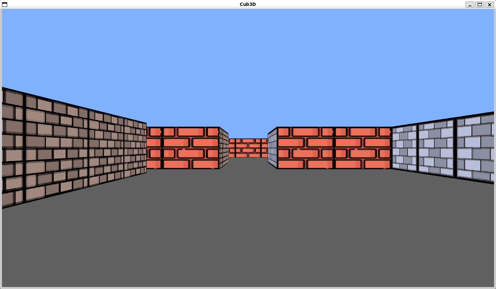

# 42-cub3D

**Score: 100/100**

This project is about making a *game* using raycasting. (Wolfenstein 3D like)

## Controls

- Move around with `W` `A` `S` `D`
- Rotate the view with `←` `→`
- Press `ESC` to exit game

## Usage

If you are on Linux just use `make` and it will give the executable `cub3D` program.

If you are on Mac you have to edit the Makefile. Comment the line under the "FOR LINUX" and uncomment the line under the "FOR MAC" part. Then use `make` to get the executable `cub3D` program.

After compiling it use it like `./cub3D [Map File]`.

There is one example map in the maps folder. You can run that like `./cub3D Maps/map.cub`.
